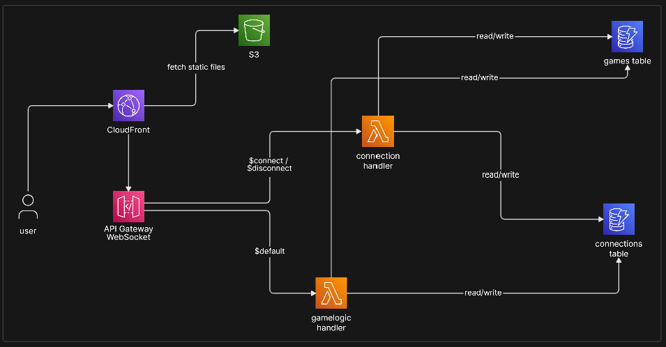

# UNO Multiplayer 🃏

A real-time, responsive multiplayer UNO web game built with React, TypeScript, and AWS Serverless infrastructure. 

## 🌟 Features

- **Real-Time Multiplayer:** Instant state synchronization across all connected clients.
- **Authoritative Backend:** All game logic, turn validations, and rule enforcements run securely on the server.
- **Rich Animations:** Powered by Framer Motion, featuring fan-styled card hands, dynamic UNO celebrations, and toast notifications.
- **Mobile First Design:** The UI is completely responsive. On mobile devices, playable cards automatically lift vertically so users can instantly identify their valid moves without needing mouse hover states.
- **Reconnection Support:** Accidentally refreshed the page or navigated away? The game uses session storage to automatically reconnect you to your active game without losing your hand.

---

## 🏗️ Project Architecture



This project is split into two distinct tiers: a static frontend and a serverless backend.

### 1. Frontend (`/frontend`)
- **Stack:** React 18, TypeScript, Vite, Framer Motion.
- **State Management:** The frontend is "dumb" regarding game logic. It maintains two state objects sent from the server:
  - `publicState`: Information everyone can see (current player, discard pile, opponent card counts, last actions).
  - `privateState`: Information only the local player knows (their specific hand of cards).
- **Communication:** Communicates with the backend entirely via WebSockets. It sends simple action payloads (e.g., `{"action": "PLAY_CARD", "payload": {"cardId": "123"}}`) and blindly renders whatever state the server broadcasts back.

### 2. Backend (`/backend`)
- **Stack:** AWS Lambda, AWS API Gateway (WebSockets), DynamoDB, Node.js + TypeScript.
- **Infrastructure:**
  - **API Gateway:** Manages the persistent WebSocket connections and routes incoming messages to the Lambda function.
  - **DynamoDB:** Maintains two tables:
    1. `uno-connections`: Maps active WebSocket Connection IDs to Room IDs and Player Session IDs.
    2. `uno-games`: Stores the complete, authoritative JSON game state for every active room.
  - **Lambda (`gameEngine.ts` & `index.mjs`):** Contains the core game engine. When a message is received, it pulls the game state from DynamoDB, validates the move, applies card effects (skips, reverses, drawing), saves the state back to DynamoDB, and broadcasts the updated masked state to all clients in the room.

---

## 🚀 Setup & Development

### Frontend Setup
1. Navigate to the frontend directory:
   ```bash
   cd frontend
   ```
2. Install dependencies:
   ```bash
   npm install
   ```
3. Run the development server:
   ```bash
   npm run dev
   ```

### Backend Setup (AWS Lambda)
The backend is bundled into a single ESM file using `esbuild` for lightweight AWS Lambda deployment.

1. Navigate to the backend directory:
   ```bash
   cd backend
   ```
2. Install dependencies (if needed):
   ```bash
   npm install
   ```
3. Build the Lambda bundle:
   ```bash
   npx esbuild lambdas/gameHandler.ts --bundle --platform=node --target=node18 --format=esm --outfile=dist/gameHandler.mjs --external:@aws-sdk/*
   ```
4. Copy the contents of `dist/gameHandler.mjs` and paste them into your AWS Lambda function's `index.mjs` file via the AWS Toolkit or AWS Console.

---

## 🎮 How to Play

1. **Host a Game:** Enter your name and click "Create Room". Share the 6-character room code with your friends.
2. **Join a Game:** Enter your name and the room code, then click "Join Room".
3. **Start Game:** Once all players are in the lobby, the host can start the game.
4. **Gameplay:**
   - Match the top card of the discard pile by color or value.
   - Play wild cards to change the color.
   - Stack `+2` or `+4` cards to build massive draw penalties for your friends!
   - Don't forget to click the **UNO!** button before you play your second-to-last card!
